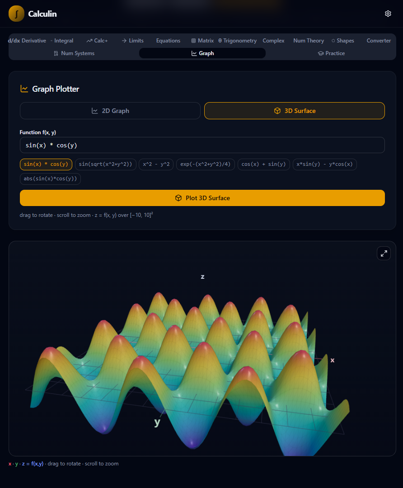

<div align="center">

# 🧮 Calculin

### Advanced Math Solver — Step-by-Step, Interactive & Free

**Derivatives · Integrals · Equations · Limits · 2D/3D Graphs · Matrices · Complex Numbers · LaTeX**

[](https://calculin.vercel.app)


**[🚀 Open App](https://calculin.vercel.app)** · **[🐛 Report Bug](https://github.com/Syntrojex/calculin/issues)** · **[💡 Request Feature](https://github.com/Syntrojex/calculin/issues)**

</div>

---

## ✨ About Calculin

**Calculin** is a free, open-source mathematics platform designed to make advanced math easier to understand.

Instead of giving you only the final answer, Calculin focuses on **step-by-step solutions**, interactive visualizations, and useful mathematical tools — all in one place.

Whether you're working on calculus, algebra, matrices, complex numbers, graphing, or number theory, Calculin gives you the tools to solve, visualize, and understand the problem.

> 🎓 **Don't just get the answer. Understand the solution.**

**No installation. No login. No account. No external APIs. Just open and start calculating.**

👉 **[Open Calculin →](https://calculin.vercel.app)**

---

## 📸 Preview

| Home Page | 3D Graph |
|:---------:|:--------:|
|  |  |
| All 14 tools in one place | Interactive surfaces powered by Three.js |

---

## 🛠️ 14 Math Tools

Every tool comes with full step-by-step working, and any result can be exported as LaTeX.

| Tool | Description |
|---|---|
| 🧮 **Derivative Solver** | Calculate derivatives with step-by-step solutions |
| ∫ **Integration Solver** | Solve definite and indefinite integrals |
| 📐 **Calculus+** | Partial derivatives, extrema (1D & 2D), double integrals |
| ∞ **Limits Calculator** | Evaluate limits, including one-sided limits and infinity |
| 🔢 **Equation Solver** | Solve linear, quadratic & polynomial equations — includes 3D implicit surface plotting |
| 🔲 **Matrix Calculator** | Determinants, inverses, rank, Cramer's rule, and more |
| 📚 **Trig Identities** | Explore and verify trigonometric identities |
| 🧠 **Complex Calculator** | Full complex number arithmetic |
| 🔢 **Number Theory** | Primes, GCD, LCM, and prime factorization |
| 📦 **Shapes Calculator** | Area, perimeter, surface area, and volume |
| 📏 **Unit Converter** | Convert between common measurement units |
| 🔄 **Number Systems** | Binary, octal, decimal, and hexadecimal conversions |
| 🌐 **Graph Plotter** | Plot functions in 2D, or visualize surfaces in 3D (Three.js) |
| 🎯 **Practice Mode** | Auto-generated problems with instant grading |

---

## ⚡ Features

- 🧠 **Step-by-step solutions** — understand the calculation, not just the result
- 🌐 **2D & 3D graphing** — powered by Three.js, including implicit surfaces
- 📝 **LaTeX export** — copy any result straight into academic work
- 🎯 **Practice mode** — auto-generated problems with instant grading
- ⌨️ **Math keyboard** — no need to memorize input syntax
- 🌙 **Dark & light themes**
- 📱 **Fully responsive** — desktop, tablet, and mobile
- ⚡ **Fast & client-side** — calculations run directly in your browser
- 🔒 **No login required — no tracking — no external APIs**
- 🆓 **Free & open source**

---

## 🎯 Practice Mode

Want to practice instead of just calculating? **Practice Mode** generates random math problems on the fly — pick **Easy, Medium, or Hard**, and the difficulty shapes the actual problem: smaller numbers and simpler forms on Easy, larger coefficients and more advanced patterns (trig, exponential) mixed in as you go up to Hard.

Solve it, check your answer, and get a fresh problem instantly — no repeats, no login, no tracking.

---

## 📁 Project Structure

```
calculin/
├── src/
│   ├── components/          # All math tool components
│   │   ├── DerivativeSolver.tsx
│   │   ├── IntegrationSolver.tsx
│   │   ├── GraphPlotter.tsx
│   │   ├── Graph3D.tsx
│   │   ├── MatrixCalculator.tsx
│   │   ├── MathInput.tsx    # Math keyboard input field
│   │   ├── MathKeypad.tsx   # On-screen math keyboard
│   │   ├── ui/              # shadcn/ui primitives
│   │   └── ...more
│   │
│   ├── routes/              # TanStack Router pages
│   ├── lib/                 # Math engine & utilities
│   │   ├── math-solver.ts
│   │   ├── math-format.ts
│   │   ├── number-format.ts
│   │   └── utils.ts
│   │
│   ├── contexts/            # Settings & theme context
│   └── hooks/               # Custom React hooks
│
├── index.html
├── vite.config.ts
└── package.json
```

---

## 🐛 Found a Bug?

This project isn't currently accepting pull requests. If you run into a bug, please [open an issue](https://github.com/Syntrojex/calculin/issues) with:

- What you were trying to do
- What happened instead
- Steps to reproduce (if possible)

Have an idea instead? [Request a feature →](https://github.com/Syntrojex/calculin/issues)

---

## 📄 License

Calculin is released under the **MIT License** — free to use, modify, and distribute.

---

## ⭐ Support Calculin

If you find Calculin useful, consider giving the project a ⭐ on GitHub. It helps the project grow and motivates future development.

**[⭐ Star Calculin on GitHub →](https://github.com/Syntrojex/calculin)**

---

<p align="center">
<a href="https://calculin.vercel.app">

</a>
</p>

<div align="center">

### 🧮 Calculin

### Calculate · Visualize · Understand

### Built with ❤️ by [Syntrojex](https://github.com/Syntrojex) (Muhammad Mustafa)

</div>
